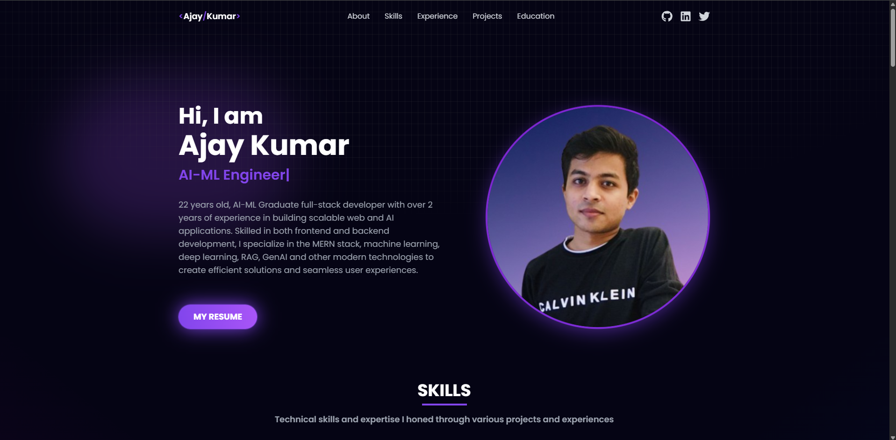

# 🚀 Ajay Kumar's Portfolio

Welcome to my personal developer portfolio — a modern, fast, and responsive web application built using **React.js**, **Vite**, and **TailwindCSS**.

Explore my projects, education, skills, experience, and get in touch with me through an elegant contact form powered by EmailJS.

---

## 📸 Preview



---

## 🛠️ Tech Stack

| Tool / Library       | Purpose                                 |
|----------------------|------------------------------------------|
| **React.js**         | UI library for building components       |
| **Vite**             | Fast build tool and development server   |
| **Tailwind CSS**     | Utility-first CSS framework              |
| **EmailJS**          | Contact form email delivery              |
| **React Router DOM** | Routing across different sections        |
| **React Icons**      | Icon support                             |
| **React Toastify**   | Toast notifications                      |
| **React Typing Effect** | Typing animation in the hero section |
| **Parallax Tilt**    | Subtle 3D hover effects for interactivity |

---

## 📁 Folder Structure

    ```bash
    AJAYKDEVAL-PORTFOLIO/
    ├── node_modules/
    ├── public/
    ├── src/
    │   ├── assets/             # Images and visual assets
    │   ├── components/         # Reusable UI components
    │   │   ├── About/
    │   │   ├── Contact/
    │   │   ├── Education/
    │   │   ├── Experience/
    │   │   ├── Footer/
    │   │   ├── Navbar/
    │   │   ├── Skills/
    │   │   ├── Work/
    │   │   └── BlurBlob.jsx
    │   ├── App.jsx             # Root component
    │   ├── constants.js        # Constant data used across site
    │   ├── index.css           # Global styles
    │   └── main.jsx            # Entry point
    ├── .env                   # Environment variables (EmailJS keys)
    ├── .gitignore             # Git ignored files
    ├── package.json           # Project dependencies and scripts
    ├── tailwind.config.js     # Tailwind config
    ├── vite.config.js         # Vite config
    └── README.md              

---

## 🔧 Available Scripts

    ```bash
    npm install    # Install dependencies
    npm run dev    # Start dev server (http://localhost:5173)

---

## 📤 Deployment

This project is deployed on Vercel for fast and scalable hosting.  
You can easily deploy it by connecting your GitHub repo to Vercel.

---

## 📬 Contact

The contact form uses EmailJS to send emails directly to my inbox.  
Environment variables are managed using a .env file and handled securely.  
💡 Don't forget to create your own EmailJS service ID, template ID, and public key before forking.

---

## 👨‍💻 Author

Ajay Kumar  
B.Tech in Artificial Intelligence & Machine Learning, GGSIPU  
📍 Delhi, India  
🌐 
📫 [Contact me via the form on the site!]

---

## ⭐️ Show Your Support

If you like this project or found it useful, feel free to star the repository ✨

---

## 🛡 License

This project is open source and available under the MIT License.

---